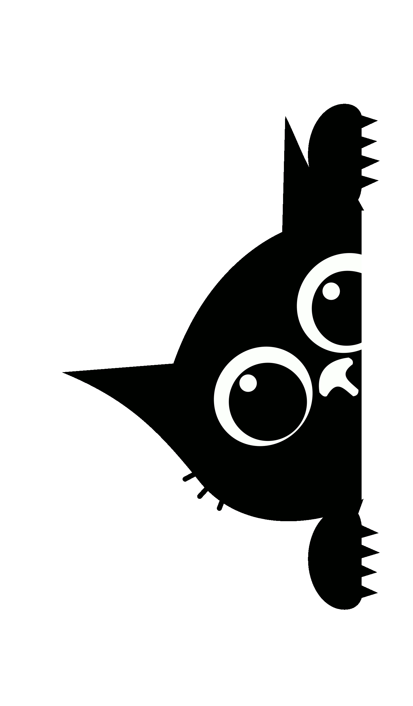

<h1 align="center"> 🌐 Mi Portafolio – David Mondaca</h1>

<p align="center">
  
</p>

Bienvenido a mi portafolio web. Este proyecto reúne mis trabajos, habilidades y proyectos desarrollados durante mi aprendizaje en desarrollo web, con un enfoque en diseño limpio, responsive y buenas prácticas.

## 🚀 Tecnologías utilizadas
- **HTML5**
- **CSS3**
- **JavaScript**
- **Bootstrap**
- **Git & GitHub**

## 🎯 Objetivo del proyecto
Crear una landing page moderna que funcione como presentación personal, mostrando:
- Información sobre mí
- Mis habilidades
- Mis proyectos
- Medios de contacto

Este proyecto es también una práctica de:
- Maquetación web responsiva
- Estructura Mobile First
- Uso de Git para control de versiones
- Publicación con GitHub Pages

## 🔗 Demo en línea
Puedes ver el sitio aquí:

👉 **https://david-hxh.github.io/mi-portafolio**

## 📸 Vista previa
*(agregar una captura de pantalla)*

## 📂 Cómo clonar este repositorio
Si deseas revisar el código o modificarlo:

```bash
git clone https://github.com/David-HxH/mi-portafolio.git
